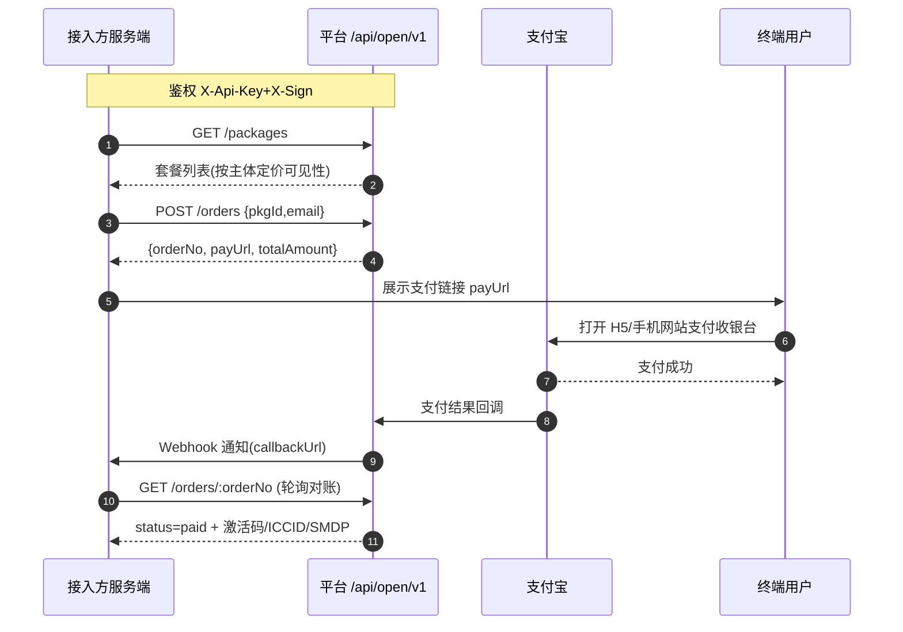
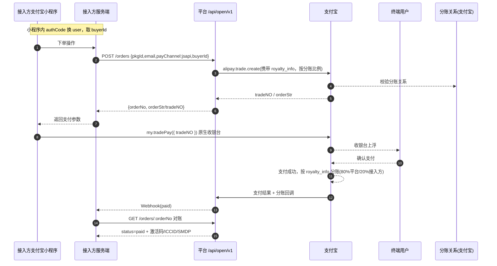

# 开放接口接入与支付方式：现状 vs 目标

> 适用读者：产品 / 后端 / 需要对接支付能力的接入方
> 目的：对比**当前已实现**的接入支付方式（H5/WAP 支付）与**后续计划**的方式（外部小程序原生支付 + 收益分账），说明各自的完整流程、参与方、前置条件、对比与落地思路。

---

## 1. 术语与角色

| 角色 | 说明 |
|---|---|
| **平台** | 本系统（YYeSim / sellsim）。拥有 TierESIM 货源、支付宝收款主体、套餐定价与 API 能力 |
| **接入方（主体 Subject）** | 通过开放 API 接入的第三方（如独立小程序、代理、经销商）。在后台「主体管理」开户并领取密钥 |
| **终端用户** | 在实际会购买 eSIM 的个人买家 |
| **支付宝** | 支付渠道（收单 + 分账能力） |

---

## 2. 方式一（现状）：开放平台 v2 + H5/WAP 支付

### 2.1 概述
接入方通过公开接口 **`/api/open/v1`** 接入，下单后拿到的是一段 **H5/WAP 支付链接（`payUrl`）**，在手机浏览器（或小程序 `web-view`）中完成支付宝收银台支付。当前**无自动分账**，支付款项全部进入平台收款主体，接入方收益由平台线下/后台手动分成。

### 2.2 参与方
```
接入方小程序 / App / 网页 ──调用──▶ 平台 /api/open/v1 ──▶ 支付宝
终端用户浏览器 ◀──payUrl 跳转── 支付宝收银台 ──支付成功──▶ 平台
```

### 2.3 完整流程

```
┌─────────────────────────────────────────────────────────────────────┐
│  一、入驻（后台完成）                                                │
│  1. 后台「主体管理」新建接入方主体（名称/回调地址/费率）→ subjectId   │
│  2. 主体「密钥管理」创建一对 keyId / keySecret（secret 仅显示一次）   │
│  3.（可选）「定价」为该主体单独设定套餐售价，默认回落平台价           │
│  → 把 keyId + keySecret + 接入文档发给接入方                         │
├─────────────────────────────────────────────────────────────────────┤
│  二、鉴权（双模）                                                   │
│  读请求：Header  X-Api-Key: <keyId>                                 │
│  写请求：Header  X-Api-Key/X-Timestamp/X-Nonce/X-Sign               │
│          X-Sign = hex(HMAC-SHA256(keySecret, "keyId\nts\nonce\nbody"))│
│  建议先用  GET /me  做连通性自测                                     │
├─────────────────────────────────────────────────────────────────────┤
│  三、选品（读）GET /regions、/packages、/packages/:pkgId             │
├─────────────────────────────────────────────────────────────────────┤
│  四、下单（写）POST /orders  body:{ pkgId, email, extOrderNo?, returnUrl? }│
│      → 返回 orderNo + payUrl（H5/手机网站支付链接）+ totalAmount      │
├─────────────────────────────────────────────────────────────────────┤
│  五、支付（终端用户）                                               │
│  1. 接入方把 payUrl 给终端用户（浏览器 / 小程序 web-view）           │
│  2. 用户在支付宝收银台完成支付 → 钱进入「平台」收款主体             │
├─────────────────────────────────────────────────────────────────────┤
│  六、结果获取（对账）                                               │
│  · 轮询：GET /orders/:orderNo 或 GET /orders?extOrderNo=            │
│  · Webhook：支付成功后平台推送 callbackUrl（可退避重试/手动补发）    │
│  · paid 后返回激活码/ICCID/SMDP                                     │
├─────────────────────────────────────────────────────────────────────┤
│  七、退款（写）POST /orders/:orderNo/refunds；GET /refunds/:refundNo │
│  八、收益结算：钱全在平台，接入方分成走线下/后台手动                 │
└─────────────────────────────────────────────────────────────────────┘
```

### 2.4 时序图



### 2.5 现状小结
- 优点：改动小、已上线、兼容各类客户端（凑浏览器/web-view 都可）；分账为线下手动，无支付宝产品门槛。
- 局限：**不是小程序原生收银台**；无自动分账。

---

## 3. 方式二（目标）：外部小程序原生支付 + 收益分账

### 3.1 概述
接入方自己在支付宝小程序里卖你的套餐，其小程序**原生调用支付宝收银台（`my.tradePay`）**完成支付；支付款仍先进入「平台」收款主体，支付成功后由支付宝按**后台可调的分账比例**（默认例：平台 80% / 接入方 20%）实时拆账到双方账户。

### 3.2 参与方
```
接入方支付宝小程序 ──鉴权+下单──▶ 平台 /api/open/v1(jsapi分支)
终端用户在接入方小程序内 ──my.tradePay──▶ 支付宝收银台
支付宝 ──支付成功──▶ 平台 ──按比例分账──▶ 平台账户 + 接入方账户
```

### 3.3 前置条件（商务 + 签约）
1. **平台收款主体开通支付宝「分账」产品**（alipay.trade.royalty 系列）——必要条件，未开则分账调不起来。
2. 每个接入方主体提供一个**实名支付宝账号**，并在平台收单主体下做**分账关系绑定**（alipay.trade.royalty.relation.bind）。
3. 接入方的小程序主体已入驻支付宝并具备 JSAPI 支付能力（能获取本用户 `buyerId`）。

### 3.4 完整流程

```
┌─────────────────────────────────────────────────────────────────────┐
│  一、入驻 + 分账关系绑定（后台 + 支付宝）                            │
│  1. 后台新建主体并生成 keyId/keySecret（同方式一）                    │
│  2. 后台新增「分账账号」+「分账比例」（如接入方 20%，后台可调）        │
│  3. 平台调用支付宝 alipay.trade.royalty.relation.bind               │
│    将主体支付宝账号绑定为分账关系人                                  │
├─────────────────────────────────────────────────────────────────────┤
│  二、鉴权（同方式一，双模）                                          │
├─────────────────────────────────────────────────────────────────────┤
│  三、选品（读，同方式一）GET /regions、/packages…                    │
├─────────────────────────────────────────────────────────────────────┤
│  四、下单（写）POST /orders 新增 payChannel=jsapi + buyerId          │
│      → 平台按该主体「分账比例」附带 royalty_info                    │
│      → 调用 alipay.trade.create 返回 orderStr / tradeNO             │
├─────────────────────────────────────────────────────────────────────┤
│  五、原生拉起支付（接入方小程序内）                                  │
│  1. 接入方小程序 authCode → 换 user → 取当前用户 buyerId            │
│  2. 表单提交 orderNo → 在其小程序内 my.tradePay({ tradeNO })        │
│  3. 支付宝原生收银台上浮，用户支付                                   │
├─────────────────────────────────────────────────────────────────────┤
│  六、分账结算（支付宝侧自动）                                       │
│  支付成功 → 支付宝按 royalty_info 将款项分账                        │
│  · 80% → 平台收款主体                                               │
│  · 20% → 接入方支付宝账户                                           │
│  （比例由后台「分账比例」实时控制，下单时刻固化）                    │
├─────────────────────────────────────────────────────────────────────┤
│  七、结果 + 对账（同方式一）                                        │
│  Webhook/轮询，paid 后返还激活码等                                  │
├─────────────────────────────────────────────────────────────────────┤
│  八、退款与分账回滚                                                 │
│  退款时需处理已分账资金：向双方退回/冲正（分账回滚逻辑）             │
└─────────────────────────────────────────────────────────────────────┘
```

### 3.5 时序图



### 3.6 涉及改造范围
| 模块 | 改动 |
|---|---|
| 支付服务 | 新增 JSAPI 下单分支（alipay.trade.create + royalty_info）；保留 H5 分支 |
| 数据模型 | Subject 增加 `分账比例`、`分账支付宝账号`；订单记录 royalty 明细 |
| 分账关系 | 调用 relationship.bind / 查询；后台可触发绑定 |
| 退款 | 已分账订单的冲正/回滚逻辑 |
| 后台 | 主体管理加分账配置；对账展示分账流水 |
| 文档 | 接入文档补充 jsapi 与分账字段 |

---

## 4. 两种方式对比

| 维度 | 方式一（现状 H5/WAP） | 方式二（目标 小程序JSAPI + 分账） |
|---|---|---|
| 支付形态 | H5/手机网站支付链接，浏览器或 web-view | 小程序内原生 `my.tradePay` 收银台 |
| 接入方客户端 | 任意（网页/App/小程序都行） | 限定支付宝小程序 |
| 收单主体 | 平台 | 平台（收款先到平台） |
| 收益分配 | 线下/后台手动分成 | 支付宝自动分账（比例后台可调） |
| 前置门槛 | 低（仅需 API 密钥） | 高（平台开通分账产品 + 分账关系绑定） |
| 改动量 | 已实现 | 新增 JSAPI + 分账 + 后台 + 退款回滚 |
| 用户体验 | 浏览器收银台（跳转/新开页） | 原生收银台（留存度更高） |
| 是否可立刻上线 | 是（线上已有） | 否（需商务签约 + 二期开发） |

---

## 5. 落地建议（两步走）
1. **第一步（低成本、可先跑通）**：落地「方式一 + 手动分成」。接入方小程序可先用 `web-view` 承载 H5 `payUrl`，即能下单。先把业务验证起来，收益由平台后台线下打款。
2. **第二步（分账自动化）**：待平台支付宝收款主体**开通「分账」产品**后，再落地方式二——加 JSAPI 下单分支 + `royalty_info` + 后台分账比例配置，用支付宝自动分账替换手动分成。

> 决策开关：`平台是否已开通支付宝分账产品 × 接入方收益是否需要实时自动到账`。两者皆为"是"才走方式二；否则先走方式一。

---

## 6. 分账关键机制（FAQ）

### 6.1 跨主体支付：小程序 A 能否用小程序 B 的支付接口收款？
**允许**。这本质是支付宝的**「服务商/代收」机制**：

- `tradeNO` 由谁用密钥调用 `alipay.trade.create` 创建，**收款主体就是谁**；
- 任何应用拿到该 `tradeNO`，只要 `buyerId` 对得上当前登录用户，都可用 `my.tradePay` 拉起收银台。

=> 接入方小程序 A 调用平台（主体 B）创建的订单支付，**完全可行**，钱先进 B（平台）账户。
=> 注意：收银台展示的收款方是 **B（平台）**，接入方白标程度有限；结算与风控归属也在收单方（平台）。

### 6.2 做分账，接收方（接入方）需要开通分账产品吗？
**不需要。** 分账的开通责任只在**收单方（平台）**。接收方只需要是：

- 支付宝**实名认证账号**即可（个人实名也可收，无需是商户、无需开通分账/结算能力）。

支付成功后，支付宝会把对应比例实时打进接收方的 **支付宝余额**（可正常提现），对方无需任何操作。与用户举的「微信分账到对方零钱」一致。

### 6.3 与微信分账的差异
| 对比 | 支付宝分账（目标方式） | 微信分账 |
|---|---|---|
| 接收方是否需要开通 | 否，实名即可 | 否，可分账给个人 |
| 钱到哪 | 对方支付宝余额（可提现） | 对方微信零钱/结算款 |
| 关系绑定 | `alipay.trade.royalty.relation.bind`，收单方发起 | 服务商/商户关系维护 |
| 接收方可为个人 | 是 | 是 |

### 6.4 一句话结论
流程层面跨主体代收允许；收益层面若要在下单时就按比例实时分给接入方，
唯一真门槛是 **平台收单主体须先开通「分账」产品**，其余（绑定/比例）都可通过接口+后台实现。

---

## 7. 分账接口清单 + 后台「绑定/解绑/比例」集成设计

### 7.1 支付宝分账关系官方接口（均由平台收单主体调用）
| 操作 | 接口 | 说明 |
|---|---|---|
| 绑定 | `alipay.trade.royalty.relation.bind` | 把某接入方支付宝账号设为分账关系人（`param_info` 传对方账号/类型；对方须为实名账号） |
| 解绑 | `alipay.trade.royalty.relation.unbind` | 解除分账关系 |
| 查询 | `alipay.trade.royalty.relation.batchquery` | 批量查询已绑定的分账关系人 |
| 下单分账 | `alipay.trade.create/pay` 携带 `royalty_info`（version=3, royalty_type=ROYALTY, trans_out=收单方, trans_in=分账方, amount=分账金额） | 支付成功即实时分账 |
| 结果对账 | `alipay.trade.query` 分账明细 / 分账查询接口 | 核对实际到各方的金额 |

> 绑定/解绑/查询是**独立于下单**的接口，因此完全能做成后台的「绑定 / 解绑」操作按钮，不必等下单时才绑定。

### 7.2 后台「开放平台 · 主体」集成设计
在现有「主体管理」中为每个开放平台主体补齐：

1. **分账接收账号**　`royaltyAccount`：填写接入方实名支付宝账号
2. **分账比例**　`splitPercent`：如 `20`，后台可调，默认 `0` = 不分账
3. **绑定/解绑操作**：填写账号+比例 → 「绑定」调 `relation.bind`；列表显示绑定状态，「解绑」调 `relation.unbind`；提供「批量查询」回显当前已绑关系用于对账

**下单路径联动**：
- `POST /orders`（jsapi 分支）读取该主体 `splitPercent`，计算 `royalty_info.amount = 实付金额 × splitPercent%`，随 `trade.create` 提交；
- 后台改比例即时生效（下单时刻读取/固化）；
- 解绑前若有在途/未结订单，需校验或提示，避免分账流向变化。